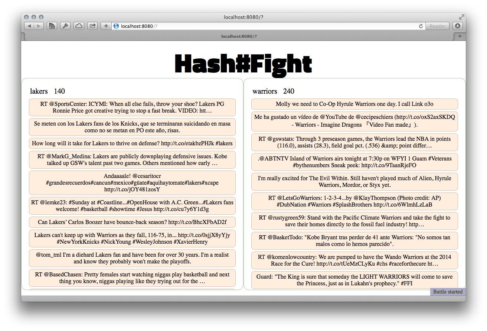

tln.HASHFIGHT
=============

a.k.a. why Tint should hire me

v0.2
------

I've completed a pretty straightforward port of the CLI experience to a Web UI. Now, the
<code>hashfight.coffee</code> can also serve up a little one page app with a similar left-right layout.

The layout needs more polish, but I'm out of time this morning. I chose the headline font to be reminiscent of a boxing poster font, with the "#" NOT slanted.

The client side script uses jQuery (and my own jquery.one.js :) ). The data connection uses sockets.io which has worked well for me in the past.

Time spent today: ~3 hours

Time spent so far: ~4.5 hours

Today I learned: absolute positioning is pretty handy for a quick layout

Next I will add: a backend service

v0.1
------

I must admit I was pretty excited about the challenge. Deadline 1 week! Impress us! And a fun little application idea, to boot.

I woke up super early because I was thinking about all the things I could put into this. What stack? Python is my go to but I went for a new favorite, coffeescript, for today.

And just to be different I didn't make a web app at first, but a console one!

Try it out:

    npm install
    cp sample.config.json config.json
    open -e config.json
    coffee hashfight.coffee nfl nba

                                            HASH BATTLE
    ┌─nfl: 10───────────────────────────────────┐┌─NobelPeacePrize: 19───────────────────────┐
    │                                           ││                                           │
    │Mugshot: #Patriots Fan With Helmet Tattoo  ││RT @MalalaFund: #MalalaYousafzai was in    │
    │On Head #NFL http://t.co/TPPFlwBuFL        ││Chemistry class when she was told by her   │
    │                                           ││teacher that she was awarded the #NobelPeac│
    │NFL Bold Logo BANNER FLAG - SF 49ers - 24" ││ePrize.                                    │
    │x 36" - Indoor/Outdoor UV resistant #NFL   ││                                           │
    │#SanFrancisco49e http://t.co/C9cD8lHmG5    ││RT @TheApocalypZe: Government of India     │
    │                                           ││should initiate a Nobel Piss Prize for     │
    │RT @RaidersITALIA: NFL a Londra - video su ││people who use public lavatories.          │
    │http://t.co/ziJA8RCa9j - Wembley pre-game  ││                                           │
    │http://t.co/w5MJEvWAT7                     ││#CleanIndia #SwachhBharat…                 │
    │                                           ││                                           │
    │RT @ESPN_FirstTake: "Andrew Luck is the    ││RT @DianeGCibrian: "#Education is          │
    │FUTURE of the NFL." - @stephenasmith       ││education and it's the right of every      │
    │http://t.co/cwzycFL5YS                     ││human being." #MalalaYousafzai #NobelPeaceP│
    │                                           ││rize                                       │
    │Scoreboard - Fri, 10 Oct 2014 PST:         ││                                           │
    │Football NFL http://t.co/LVodFLHjC6        ││#MalalaYousafzai &amp; #KailashSatyarthi   │
    │                                           ││अगर एसे लोग किसी भी देश के नेता होंगे तोrize         │
    │the NFL is making "beats" MORE cool and    ││उस देश का भविष्य निश्चितRरूप से उज्वल               │
    └───────────────────────────────────────────┘└───────────────────────────────────────────┘
                                http://localhost:8080 (coming soon)

Time spent so far: ~1.5 hours

Today I learned: one page of coffeescript + npm can go a long way

Next I will add: minimum web interface

